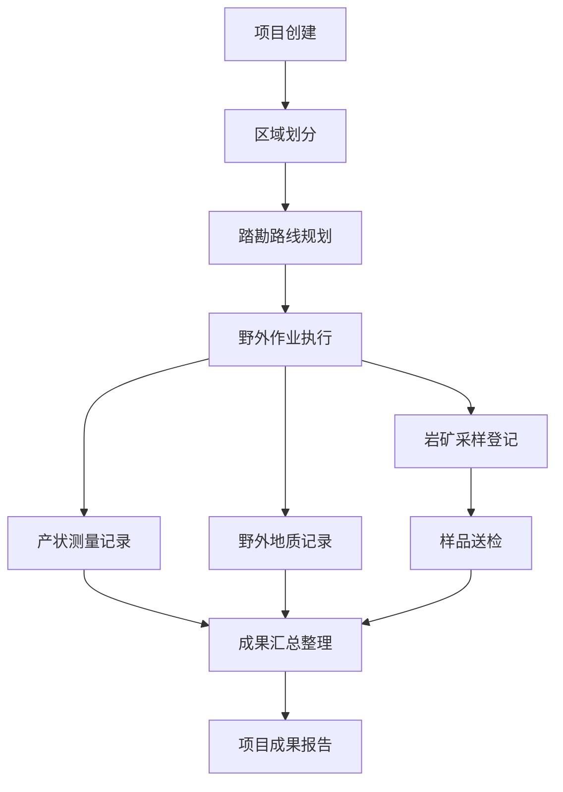

# 野外地质勘探队客户端软件 产品需求文档

## 1. 产品概述

野外地质勘探队客户端软件是一款面向地质勘探队伍的野外作业管理系统，旨在数字化、规范化地管理勘探过程中的踏勘、采样、测量、记录等全流程工作。

- **目标用户：地质勘探队员、项目负责人、安全管理人员
- **核心价值**：提升野外作业效率、保障作业安全、规范数据采集流程

## 2. 核心功能

### 2.1 用户角色

| 角色 | 登录方式 | 核心权限 |
|------|----------|----------|
| 勘探队员 | 账号登录 | 踏勘路线查看、采样登记、产状测量、野外记录、安全报备 |
| 项目负责人 | 账号登录 | 项目管理、路线规划、成果审核、安全管理 |
| 安全管理员 | 账号登录 | 安全检查、隐患排查、应急预案管理 |

### 2.2 功能模块

1. **项目区域模块**：勘探项目区划管理
2. **踏勘路线模块**：踏勘路线规划与管理
3. **岩矿采样模块**：岩矿标本采样登记、采样点坐标
4. **产状测量模块**：地层产状测量、罗盘定向
5. **野外记录模块**：野外地质记录
6. **安全管理模块**：野外营地管理、独头作业报备、毒蛇蚊虫防护
7. **成果整理模块**：样品送检、勘探成果汇总

### 2.3 页面详情

| 页面名称 | 模块名称 | 功能描述 |
|---------|---------|---------|
| 仪表盘 | 首页概览 | 项目统计、待办事项、最近动态 |
| 项目区域 | 项目区划 | 项目列表、项目详情、区域划分、地图展示 |
| 踏勘路线 | 路线规划 | 路线列表、路线绘制、路线详情、点位管理 |
| 岩矿采样 | 采样登记 | 采样列表、采样登记、采样点坐标、样品详情 |
| 产状测量 | 产状测量 | 测量记录、罗盘定向、产状数据统计 |
| 野外记录 | 地质记录 | 记录列表、新建记录、图文记录 |
| 安全管理 | 安全管理 | 营地管理、独头作业报备、防护知识 |
| 成果整理 | 成果汇总 | 样品送检、成果报告、数据统计 |

## 3. 核心流程

## 4. 用户界面设计

### 4.1 设计风格

- **主色调**：深岩石灰 (#2D3B45) - 专业沉稳，体现地质勘探的严谨性
- **辅助色**：赭石橙 (#D97706) - 温暖活力，象征岩石与土壤的色彩
- **强调色**：森林绿 (#166534) - 自然安全，代表自然与安全
- **警示色**：砖红 (#B91C1C) - 用于安全警示
- **背景色**：浅石灰 (#F8FAFC) - 清爽干净的工作背景

- **按钮风格**：圆角矩形按钮，悬停有微立体效果
- **字体**：中文使用思源黑体，英文使用 Roboto，专业易读
- **布局风格**：侧边导航 + 主内容区，卡片式布局
- **图标风格**：线性图标，地质勘探主题图标

### 4.2 页面设计概览

| 页面名称 | 模块名称 | UI元素 |
|---------|---------|-------|
| 仪表盘 | 首页概览 | 统计卡片、任务列表、项目进度条、地图缩略图 |
| 项目区域 | 项目区划 | 项目卡片列表、地图视图、筛选工具栏 |
| 踏勘路线 | 路线规划 | 路线列表、地图绘制工具、路线详情面板 |
| 岩矿采样 | 采样登记 | 采样表格、表单弹窗、坐标显示、采样点地图 |
| 产状测量 | 产状测量 | 罗盘可视化、测量数据列表、数据图表 |
| 野外记录 | 地质记录 | 记录卡片、富文本编辑器、图片上传 |
| 安全管理 | 安全管理 | 安全卡片、报备表单、知识库列表 |
| 成果整理 | 成果汇总 | 统计图表、送检列表、报告导出 |

### 4.3 响应式设计

采用桌面优先设计，支持平板适配。主要交互优化触摸操作。

### 4.4 地图可视化

- 使用地图展示项目区域、采样点、路线
- 支持缩放、平移交互
- 不同类型点位标识
