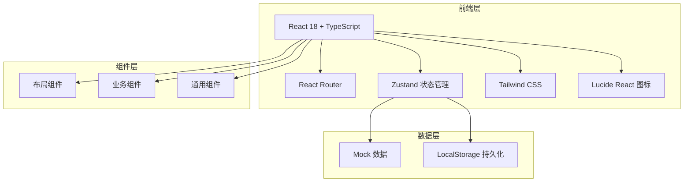
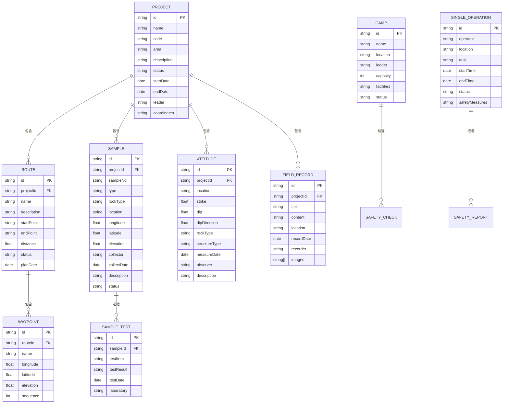

# 野外地质勘探队客户端软件 技术架构文档

## 1. 架构设计



## 2. 技术栈说明

- **前端框架**：React@18 + TypeScript
- **构建工具**：Vite@5
- **路由管理**：React Router DOM@6
- **状态管理**：Zustand
- **样式方案**：Tailwind CSS@3
- **图标库**：Lucide React
- **数据方案**：Mock 数据 + LocalStorage 持久化
- **初始化工具**：vite-init

## 3. 路由定义

| 路由路径 | 页面名称 | 功能描述 |
|---------|---------|---------|
| /dashboard | 仪表盘 | 项目概览、统计数据、待办事项 |
| /projects | 项目区域 | 项目列表、项目详情、区域管理 |
| /routes | 踏勘路线 | 路线规划、路线列表、路线详情 |
| /sampling | 岩矿采样 | 采样登记、采样列表、样品管理 |
| /attitude | 产状测量 | 产状记录、罗盘定向、数据统计 |
| /records | 野外记录 | 地质记录、记录列表、新建记录 |
| /safety | 安全管理 | 营地管理、作业报备、防护知识 |
| /results | 成果整理 | 样品送检、成果汇总、报告导出 |

## 4. 数据模型

### 4.1 数据模型定义



### 4.2 数据初始化

使用 Mock 数据模拟，存储于 LocalStorage 中实现数据持久化。

## 5. 项目结构

```
src/
├── components/          # 通用组件
│   ├── Layout/         # 布局组件
│   ├── Card/           # 卡片组件
│   ├── Table/          # 表格组件
│   ├── Form/           # 表单组件
│   └── Map/            # 地图相关组件
├── pages/              # 页面组件
│   ├── Dashboard/      # 仪表盘
│   ├── Projects/       # 项目区域
│   ├── Routes/         # 踏勘路线
│   ├── Sampling/       # 岩矿采样
│   ├── Attitude/       # 产状测量
│   ├── Records/        # 野外记录
│   ├── Safety/         # 安全管理
│   └── Results/        # 成果整理
├── store/              # 状态管理
│   └── useStore.ts
├── data/               # Mock 数据
│   └── mockData.ts
├── types/              # 类型定义
│   └── index.ts
├── utils/              # 工具函数
│   └── helpers.ts
├── App.tsx
├── main.tsx
└── index.css
```

## 6. 核心组件设计

### 6.1 布局组件

- **Sidebar**: 侧边导航栏
- **Header**: 顶部栏
- **MainLayout**: 主布局容器

### 6.2 业务组件

- **ProjectCard**: 项目卡片
- **SampleTable**: 采样表格
- **RouteMap**: 路线地图
- **Compass**: 罗盘组件
- **RecordCard**: 记录卡片
- **SafetyCard**: 安全卡片

### 6.3 通用组件

- **StatCard**: 统计卡片
- **Modal**: 弹窗组件
- **Button**: 按钮组件
- **Badge**: 状态标签
- **Icon**: 图标组件
